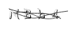
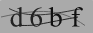

# svg captcha smooth
based on svg-captcha(https://github.com/steambap/svg-captcha)
generate svg captcha in node.js just for own projects,
as we need to make the captcha be recognized much easier by human.

## sample image
captcha image by svg-captcha:



new captcha image:



## install
> npm install --save svg-captcha-smooth

## usage
```Javascript
var svgCaptcha = require('svg-captcha-smooth');

var captcha = svgCaptcha.create();
console.log(c);
// {data: '<svg.../svg>', text: 'abcd'}
```
with express
```Javascript
var svgCaptcha = require('svg-captcha-smooth');

app.get('/captcha', function (req, res) {
	var captcha = svgCaptcha.create();
	req.session.captcha = captcha.text;
	
	res.set('Content-Type', 'image/svg+xml');
	res.status(200).send(captcha.data);
});
```

## API

#### `svgCaptcha.create(options)`  
If no option is passed, you will get a random string of four characters and corresponding svg.  
  
* `size`: 4 // size of random string  
* `ignoreChars`: '0o1i' // filter out some characters like 0o1i  
* `noise`: 1 // number of noise lines  
* `color`: true // characters will have distinct colors instead of grey, true if background option is set  
* `background`: '#cc9966' // background color of the svg image  

This function returns an object that has the following property:
* `data`: string // svg path data
* `text`: string // captcha text

#### `svgCaptcha.createMathExpr(options)`  
Similar to create api, you have the same options and return value. 
The difference is that data is a svg will be an math equation on screen 
and text will be the result of that equation in string, otherwise the usage 
is the same as above.

#### `svgCaptcha.loadFont(url)`
Load your own font and override the default font.
* `url`: string // path to your font
This api is a wrapper around loadFont api of opentype.js.  
Your may need experiment around various options to make your own font accessible.  
See the following api.

#### `svgCaptcha.options`
Gain access to global setting object. 
It is used for create and createMathExpr api as the default options.  
  
In addition to size, noise, color, and background, you can also set the following property:
* `width`: number // width of captcha
* `height`: number // height of captcha
* `fontSize`: number // captcha text size
* `charPreset`: string // random character preset

#### `svgCaptcha.randomText([size|options])`  
return a random string.
#### `svgCaptcha(text, options)`
return a svg captcha based on text provided.  

## License
[MIT](LICENSE.md)